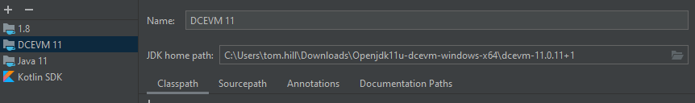
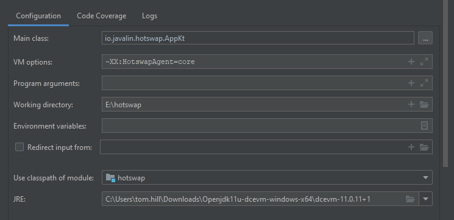

### Javalin and Hot Reload
This document attempt to summarise progress against making a hot reload plugin for Javalin using DCEVM and HotswapAgent
for contributors to Javalin.

##### The Problem
Even though Javalin restarts quickly, the whole write code > compile > restart cycle is a bit of a pain.  For this 
reason, frameworks such as Spring Boot, Quarkus and Micronaut often have a "dev mode" in which changes to any code in
the application via compilation automatically restart the entire application, thus speeding up the development cycle.

#### Potential Solution
The concept of hot reload can be split into two parts.

_Class Redefinition_

Firstly, we want to make it so that as many classes as possible can be modified "live".  This can be done by installing
DCEVM which is an enhanced JVM with support for much more redefinition than the standard JDK.  As an example, suppose
we have the following basic Javalin app

```kotlin
fun main(args: Array<String>){
  val controller = Controller()
  val server = Javalin.create().start(7777)
  server.get("/",controller::home)
}
```
with a separate class for the controller
```kotlin
class Controller{
  fun home(ctx: Context){
    ctx.result("hello world")
  }
}
```
Using the default JDK debug mechanism we could change "hello world" to "hello Javalin" and have the application update
without needing to restart Javalin.  However, if we wanted to extract the hello world into a function then we couldn't
as the JVM does not support adding methods in debug mode. DCEVM on the other hand would be perfectly happy.

This means, using DCEVM you can make a lot more of the modifications than you can with the standard JVM debug mode.

_Adding Routes / Changing Config_

The BIG problem is that, although you can change classes which contain routes or Javalin configuration, the app won't
pick up those new routes as Javalin is already running.  The perfect solution would therefore to be for Javalin to
be restarted whenever any class changes.

Fortunately, DCEVM has a plugin infrastructure which can be used for this (and there are existing plugins for Spring,
Hibernate, Logback, MyBatis, etc) via [Hotswap Agent](http://hotswapagent.org/mydoc_custom_plugins.html)

I've therefore tried to implement a prototype of a hotswap agent which might restart Javalin.

#### Progress
I've worked out how to get my plugin registered and how to get my own code called whenever a class changes.  However,
the problem is that as soon as I stop Javalin so I can re-start it to pick up the changes, the application exits (as it
was just waiting on server to exit).  I don't know enough about the Javalin codebase to know the best way round this.

#### Getting This Working
Steps for getting this working are pretty easy

1. Download DCEVM from [here](https://github.com/TravaOpenJDK/trava-jdk-11-dcevm/releases)
2. Install on your machine - from memory this was just extracting the zip file
3. Register the JVM with IntelliJ through module settings 



4. Modify your run configuration to use DCEVM and to use the internal hotswap agent



5. Start the app using this run configuration **in debug mode**.

At that point you should see a lot of debug messages, but the core ones are

```
HOTSWAP AGENT: 17:05:53.564 DEBUG (org.hotswap.agent.annotation.handler.OnClassLoadedHandler) - Init for method public static final void io.javalin.hotswap.ReloadPlugin.onApplicationStart(org.hotswap.agent.javassist.CtClass)
HOTSWAP AGENT: 17:05:53.564 DEBUG (org.hotswap.agent.util.HotswapTransformer) - Registering transformer for class regexp 'io.javalin.hotswap.App'.
HOTSWAP AGENT: 17:05:53.566 DEBUG (org.hotswap.agent.config.PluginRegistry) - Plugin registered class io.javalin.hotswap.ReloadPlugin.
HOTSWAP AGENT: 17:05:53.566 INFO (org.hotswap.agent.config.PluginRegistry) - Discovered plugins: [Reload Plugin]
```

which is the plugin being discovered and then 

```
HOTSWAP AGENT: 17:05:53.657 INFO (io.javalin.hotswap.ReloadPlugin) - reload plugin initialised
```
which tells us it has been created correctly.

If you now modify TestClass to change "hello world" to "hello javalin" and compile it, you should find the following
messages
```
class reloaded so we need to restart the application
HOTSWAP AGENT: 17:22:47.735 DEBUG (org.hotswap.agent.command.impl.SchedulerImpl) - Executing Command{class='io.javalin.hotswap.App', methodName='reload'}
Hurray - our reloading logic is being called
[Thread-13] INFO io.javalin.Javalin - Stopping Javalin ...
Disconnected from the target VM, address: '127.0.0.1:64832', transport: 'socket'
```

So it goes well initially - we find out that a class has been reloaded and we manage to reflectively call a method on
our app class in order to do the reloading.  However, as soon as we call "stop" on the server instance, the application
main method finishes and so it never gets restarted.

I'm not sure how to get round this as I'm not familiar with the underlying architecture